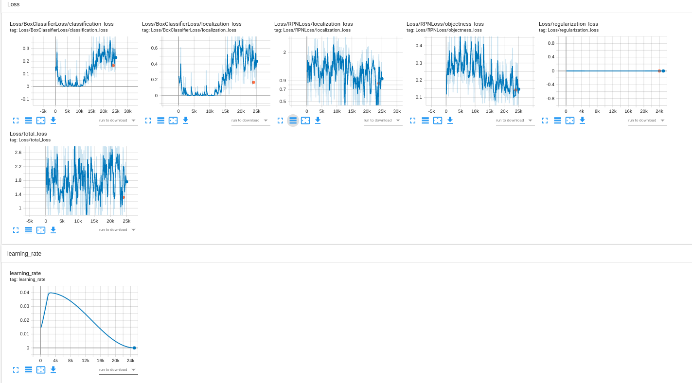

# Object Detection in an Urban Environment
 
## Project overview
This project explores running object detection model/models for self-driving cars.
Object detection is an important component of a self-driving car system. It allows sensing obstacles in an environment, in
this case, using images from a camera. Such observations can later be used in sensor fusion and tracking systems.
The data used for this project is data from the [Waymo Open dataset](https://waymo.com/open/).
 
## Set up
using docker:
to build an image from the project folder run:
```
docker build -t project-dev -f Dockerfile .
```
 
to create a container run:
```
docker run --gpus all -v <PATH TO LOCAL PROJECT FOLDER>:/app/project/ --network=host -ti project-dev bash
```
 
## Dataset
The data used for this project is data from the [Waymo Open dataset](https://waymo.com/open/). It contains RGB images of streets and reads with object detection labels. The labels include bounding boxes around each object and a class: car, pedestrian or cyclist.
### 1. Dataset Analysis
The dataset analysis will explore two aspects of the dataset:
 
   a. Images analysis and exploration for the purpose of understanding image conditions and labeling quality. This will aid in determining the required or useful image augmentations.
   b. Class analysis for the purpose of understanding the class imbalance that might be present in the dataset.
 
#### a. Image analysis:

Figure 1: image exploratory data analysis
 
As can be seen from the Figure 1 above, the images in the dataset were taken in a range of weather and lighting conditions, including fog, rain and very dark conditions. This suggests that it might be a good idea to add augmentations to the training dataset that will alter brightness, contrast, hue, saturation and other color distortions. In addition, jittering of bounding boxes could be helpful.
 
#### b. class analysis:

Figure 2: class exploratory data analysis. top: histograms of the number of objects in each images for each class from a 30000 images sample, bottom: the number of objects per class from a 30000 images sample
 
Figure 2 clearly shows the class imbalance in the dataset where in a sample of 30000 images we get ~500000 cars and only ~200000 pedestrians and very few cyclists. Some images can have more than 40 car objects in them, but very few will have that amount of pedestrians and the highest number of cyclists objects is lower than 10.
 
### 2. Cross-validation
In this project we are working with 100 segments. For this experiment the data was shuffled and split into a training set containing 70% of the data (70 segments) and a validation and test sets containing 15 segments each.
The validation set is intended to be used for metrics analysis and loss comparison between the test and validation set, usually during training. It is used to choose the best checkpoint at the end of training. The test set is used after the checkpoint was chosen to determine the actual performance of the model.
 
## Training:
 
### Reference experiment
config file  can be found in `.project/experiments/reference3`
 
   * model = SSD ResNet50 fpn 640x640
   * lr = base 0.04 with cosine_decay_learning_rate
   * loss weights = [classification_weight: 1.0,
     localization_weight: 1.0]
   * batch_size = 2
   * steps = 25000
   * augmentations = [random_horizontal_flip,random_crop_image]
 
analysis: the total training loss went down to ~1.3 during training, eval loss at step 24000 was 1.332. Both localization and classification loss graphs are more wobbly. Eval localization loss  are almost the same as training losses
 
possible improvements: add augmentations, change loss weighting, change the learning rate, change model.
 
MAP (large) = 0.1359
 
MAP (medium) = 0.055
 
MAP (small) = 0.000
 
MAP 0.5 iou = 0.050
 
MAP 0.75 iou = 0.01399
 
Recall (large) = 0.519
 
Recall (medium) = 0.258
 
Recall(small) = 0.046
 
 
 

 
Mean average precision and recall
 

 
### Improve on the reference
Several attempts were made in order to improve the original results.
Changes that were made include changing the learning rate, changing the model, adding augmentations, changing the batch size and training for longer, changing the loss weights.
 
#### adding few augmentations
config file  can be found in `.project/experiments/experiment7`
 
   * model = SSD ResNet50 fpn 640x640
   * lr = base 0.04 with cosine_decay_learning_rate
   * loss weights = [classification_weight: 1.0,
     localization_weight: 1.0]
   * batch_size = 2
   * steps = 25000
   * augmentations = [random_horizontal_flip,andom_rgb_to_gray,  random_adjust_brightness,random_adjust_contrast]
 
 
 
analysis: the total training loss went down more smoothly to ~0.92 during training, eval loss at step 24000 was 1.244. Both localization and classification loss graphs are more wobbly. Eval localization loss seems higher than training loss, classification losses are almost the same.
It seems like precision and recall improved in comparison to the reference, but are still very low.
 
possible improvements: add augmentations, change loss weighting, change the learning rate.
 
MAP (large) = 0.26
 
MAP (medium) = 0.177
 
MAP (small) = 0.017
 
MAP 0.5 iou = 0.106
 
MAP 0.75 iou = 0.05
 
Recall (large) = 0.519
 
Recall (medium) = 0.258
 
Recall(small) = 0.046
 
 

 
Mean average precision and recall
 

 
#### adding more augmentations, lowering the learning rate
config file  can be found in `.project/experiments/experiment7`
 
   * model = SSD ResNet50 fpn 640x640
   * lr = base 0.01 with cosine_decay_learning_rate
   * loss weights = [classification_weight: 1.0,
     localization_weight: 1.0]
   * batch_size = 2
   * steps = 25000
   * augmentations = [random_horizontal_flip,andom_rgb_to_gray,  random_adjust_brightness,random_adjust_contrast,random_adjust_hue,random_adjust_saturation,random_distort_color,random_jitter_boxes,random_crop_image]
 
 
 
analysis: the total training loss went down much less smoothly smoothly to ~0.9 during training, eval loss at step 24000 was 1.261. Both localization and classification loss graphs are more wobbly. Both classification and localization eval lossed seems higher than training loss.
It seems like precision and recall improved in comparison to the reference, but are still very low and not different from the previous experiment.
 
possible improvements:  change loss weighting, change batch size.
 
MAP (large) = 0.26
 
MAP (medium) = 0.22
 
MAP (small) = 0.02
 
MAP 0.5 iou = 0.122
 
MAP 0.75 iou = 0.058
 
Recall (large) = 0.43
 
Recall (medium) = 0.31
 
Recall(small) = 0.05
 
 

 
Mean average precision and recall
 

 
#### changing batch size, learning rate
config file  can be found in `.project/experiments/experiment5`
 
   * model = SSD ResNet50 fpn 640x640
   * lr = base 0.01 with cosine_decay_learning_rate
   * loss weights = [classification_weight: 1.0,
     localization_weight: 1.0]
   * batch_size = 32
   * steps = 25000
   * augmentations = [random_horizontal_flip,andom_rgb_to_gray,  random_adjust_brightness,random_adjust_contrast,random_adjust_hue,random_adjust_saturation,random_distort_color,random_jitter_boxes,random_crop_image]
 
 
 
analysis: the total training loss went down  to ~0.92 during training, however eval loss at step 24000 was 0.83, suggesting overfitting. Both localization and classification loss graphs are more classification and localization eval lossed seem much higher than training loss, and did'nt change much from previous experiments.
It seems like precision improved significantly, recall is the same as in previous experiments.
 
MAP (large) = 0.75
 
MAP (medium) = 0.47
 
MAP (small) = 0.07
 
MAP 0.5 iou = 0.3414
 
MAP 0.75 iou = 0.136
 
Recall (large) = 0.32
 
Recall (medium) = 0.25
 
Recall(small) = 0.034
 
possible improvements:  change loss weighting, change model
 

 
Mean average precision and recall
 

 
 
#### changing loss weighting
config file  can be found in `.project/experiments/experiment10`
 
   * model = SSD ResNet50 fpn 640x640
   * lr = base 0.01 with cosine_decay_learning_rate
   * loss weights = [classification_weight: 0.5,
     localization_weight: 1.5]
   * batch_size = 4
   * steps = 25000
   * augmentations = [random_horizontal_flip,andom_rgb_to_gray,  random_adjust_brightness,random_adjust_contrast,random_adjust_hue,random_adjust_saturation,random_distort_color,random_jitter_boxes,random_crop_image]
 
 
 
analysis: the total training loss went down  to ~0.92 during training, however eval loss at step 24000 was 0.83, suggesting overfitting. Both localization and classification loss graphs are more classification and localization eval lossed seem much higher than training loss, and did not change much from previous experiments.
It seems like precision and recall did not improve.
 
MAP (large) = 0.19
 
MAP (medium) = 0.15
 
MAP (small) = 0.001
 
MAP 0.5 iou = 0.0804
 
MAP 0.75 iou = 0.037
 
Recall (large) = 0.32
 
Recall (medium) = 0.25
 
Recall(small) = 0.034
 
 
possible improvements:  change loss weighting, change model
 

 
Mean average precision and recall
 

 
 #### changing the model to faster masksrcnn:
config file  can be found in `.project/experiments/experiment9`
 
   * model = Faster R-CNN ResNet50 V1 640x640
   * lr = base 0.04 with cosine_decay_learning_rate
   * loss weights = [second_stage_localization_loss_weight: 2.0,
   second_stage_classification_loss_weight: 1.0]
   * batch_size = 2
   * steps = 25000
   * augmentations = [random_horizontal_flip,andom_rgb_to_gray,  random_adjust_brightness,random_adjust_contrast,random_adjust_hue,random_adjust_saturation,random_distort_color,random_jitter_boxes,random_crop_image]
 
analysis: the total loss did not go down during the whole experiment, but the  BoxClassifierLoss/classification_loss and Loss/BoxClassifierLoss/localization_loss mostly went up. Loss/RPNLoss/objectness_loss and Loss/RPNLoss/localization_loss went slightly down.
 
possible solutions: change loss weighting, train for longer time, change the learning rate.
 
MAP (large) = 0.2217
 
MAP (medium) = 0.1579
 
MAP (small) = 0.0117
 
MAP 0.5 iou = 0.107
 
MAP 0.75 iou = 0.034
 
Recall (large) = 0.271
 
Recall (medium) = 0.249
 
Recall(small) = 0.04412
 
 

 
Mean average precision and recall
 

 

